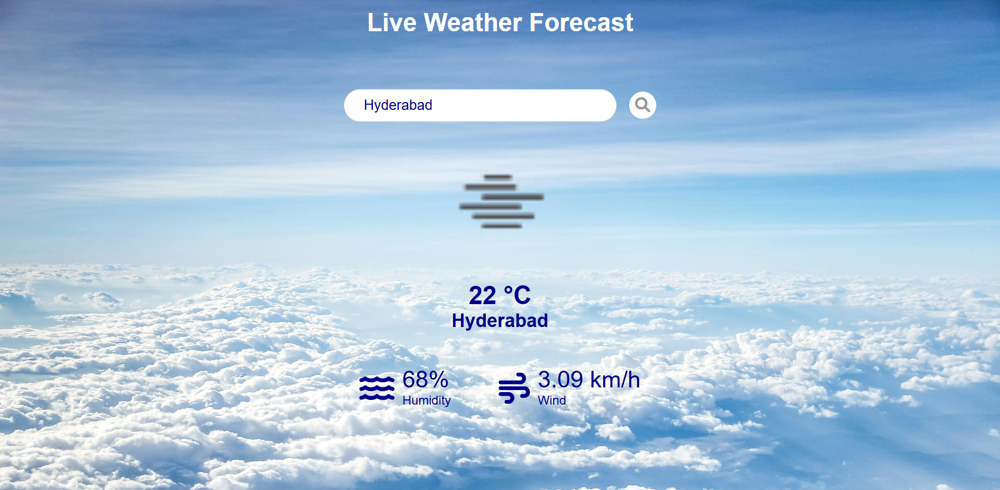

# Forecast Pro
"Forecast Pro: Real-time weather updates and forecasts searchable by city name worldwide."

## 🌦️ Weather App
**Forecast Pro** is a simple yet powerful weather app that allows users to check the current weather conditions of cities around the world. It fetches real-time data from the OpenWeatherMap API and displays it in a user-friendly interface.

---

## 🚀 Features
✅ **Real-Time Weather Data:** Fetches real-time weather data from the OpenWeatherMap API.  
✅ **City Search:** Users can search for weather information by entering the city name.  
✅ **Unit Conversion:** Option to display temperature in **Celsius** or **Fahrenheit**.  
✅ **Error Handling:** Displays an error message if the entered city is not found.  
✅ **Responsive Design:** The app is designed to work seamlessly on both desktop and mobile devices.  

---

## 🛠️ Technologies Used
- **HTML** – Markup language for creating the structure of the web page.  
- **CSS** – Stylesheet language for styling the web page.  
- **JavaScript** – Programming language for implementing interactive features and fetching data from the API.  
- **OpenWeatherMap API** – Provides weather data for various locations.  

---

## 📖 Usage
1. **Enter the city name** for which you want to check the weather in the search bar.  
2. **Click on the search button** to fetch the weather data.  
3. The weather information for the entered city will be displayed if found.  
4. Use the **unit toggle option** to switch between Celsius and Fahrenheit.  
5. If the city is not found or there is an error, an error message will be displayed.  

---

## 🤝 Contributing
Contributions are welcome!  
- If you have any ideas, enhancements, or bug fixes, feel free to submit a pull request.  
- For major changes, please open an issue first to discuss what you would like to change.  

---

## 🌍 Demo
Here is a preview of the **Forecast Pro** interface:

---

